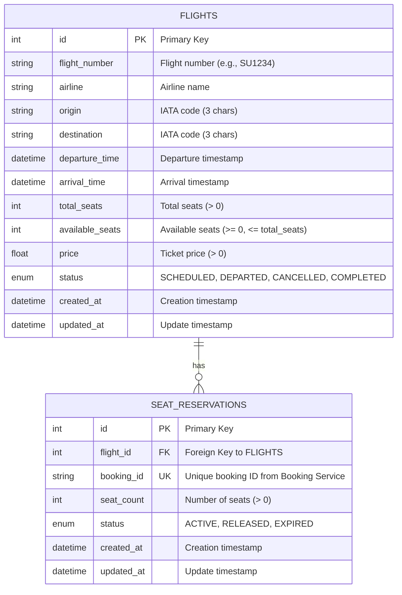
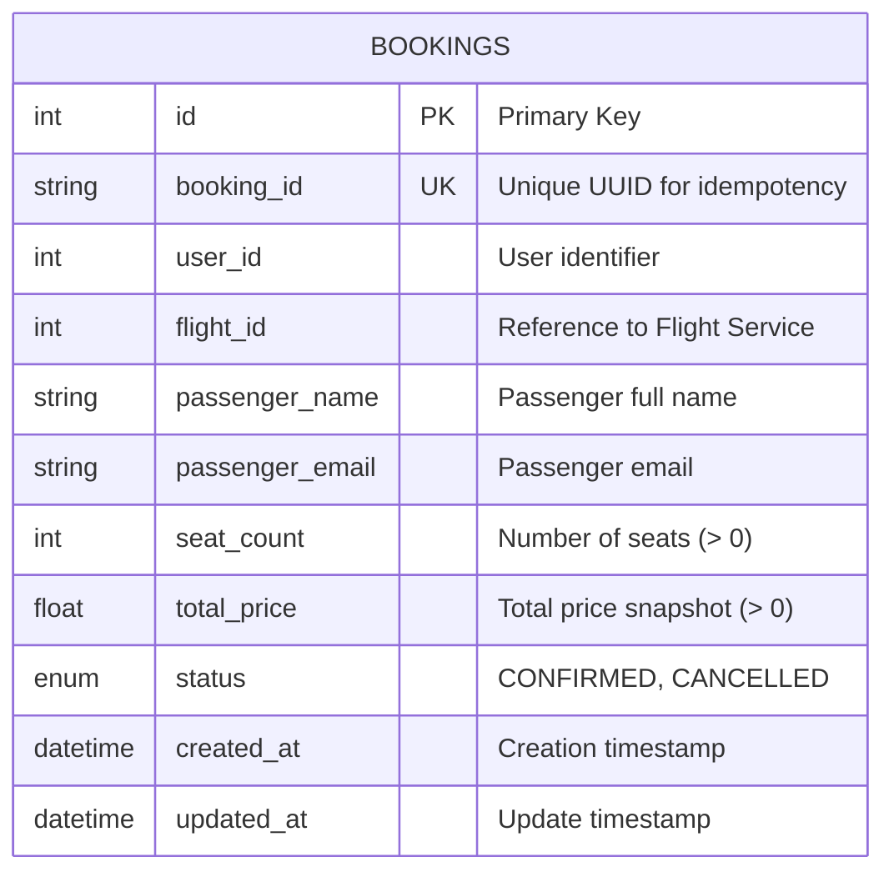

# ER Diagram - Flight Booking System

## Database Schema (3NF)

The system uses two separate databases following the microservices pattern.

### Flight Service Database



**Constraints:**
- `FLIGHTS.total_seats > 0`
- `FLIGHTS.available_seats >= 0`
- `FLIGHTS.available_seats <= FLIGHTS.total_seats`
- `FLIGHTS.price > 0`
- `UNIQUE(flight_number, departure_time)` - Same flight number can exist on different dates
- `SEAT_RESERVATIONS.seat_count > 0`
- `SEAT_RESERVATIONS.booking_id UNIQUE` - One reservation per booking

### Booking Service Database



**Constraints:**
- `BOOKINGS.seat_count > 0`
- `BOOKINGS.total_price > 0`
- `BOOKINGS.booking_id UNIQUE` - Ensures idempotency

## Normalization (3NF)

### First Normal Form (1NF)
- All attributes contain atomic values
- No repeating groups
- Each column contains values of a single type

### Second Normal Form (2NF)
- Meets 1NF requirements
- All non-key attributes are fully functionally dependent on the primary key
- No partial dependencies

### Third Normal Form (3NF)
- Meets 2NF requirements
- No transitive dependencies
- All attributes depend only on the primary key

**Example:**
- `FLIGHTS` table: All attributes (airline, origin, destination, etc.) depend solely on `id`
- `SEAT_RESERVATIONS` table: All attributes depend solely on `id`, with `flight_id` as a proper foreign key
- `BOOKINGS` table: All attributes depend solely on `id`, with `flight_id` as a reference (not FK due to separate database)

## Relationships

### Within Flight Service
- **One-to-Many**: One `FLIGHT` can have many `SEAT_RESERVATIONS`
- Cascade delete: When a flight is deleted, all its reservations are deleted

### Cross-Service Reference
- `BOOKINGS.flight_id` references `FLIGHTS.id` in Flight Service (logical reference, not FK)
- `SEAT_RESERVATIONS.booking_id` references `BOOKINGS.booking_id` in Booking Service (logical reference, not FK)
- These are maintained through application logic and gRPC calls, not database constraints

## Data Integrity

### Flight Service
1. **Seat availability**: `available_seats` is updated atomically using `SELECT FOR UPDATE`
2. **Reservation uniqueness**: `booking_id` is unique to prevent duplicate reservations
3. **Positive constraints**: All counts and prices must be positive
4. **Status transitions**: Managed by application logic

### Booking Service
1. **Price snapshot**: `total_price` is calculated and stored at booking time
2. **Idempotency**: `booking_id` (UUID) ensures duplicate requests don't create multiple bookings
3. **Status management**: Only CONFIRMED bookings can be cancelled

## Alternative Formats

### dbdiagram.io Format

```
Table flights {
  id integer [primary key, increment]
  flight_number varchar(10) [not null]
  airline varchar(100) [not null]
  origin varchar(3) [not null]
  destination varchar(3) [not null]
  departure_time timestamp [not null]
  arrival_time timestamp [not null]
  total_seats integer [not null]
  available_seats integer [not null]
  price float [not null]
  status varchar(20) [not null]
  created_at timestamp [default: `now()`]
  updated_at timestamp [default: `now()`]

  indexes {
    (flight_number, departure_time) [unique]
  }
}

Table seat_reservations {
  id integer [primary key, increment]
  flight_id integer [not null, ref: > flights.id]
  booking_id varchar(100) [unique, not null]
  seat_count integer [not null]
  status varchar(20) [not null]
  created_at timestamp [default: `now()`]
  updated_at timestamp [default: `now()`]
}

Table bookings {
  id integer [primary key, increment]
  booking_id varchar(100) [unique, not null]
  user_id integer [not null]
  flight_id integer [not null]
  passenger_name varchar(200) [not null]
  passenger_email varchar(200) [not null]
  seat_count integer [not null]
  total_price float [not null]
  status varchar(20) [not null]
  created_at timestamp [default: `now()`]
  updated_at timestamp [default: `now()`]
}
```

## Notes

1. **Separate Databases**: Each service has its own database, following microservices best practices
2. **No Foreign Keys Across Services**: Cross-service references are logical only
3. **Eventual Consistency**: System maintains consistency through compensating transactions
4. **Idempotency**: Both services support idempotent operations using unique identifiers
